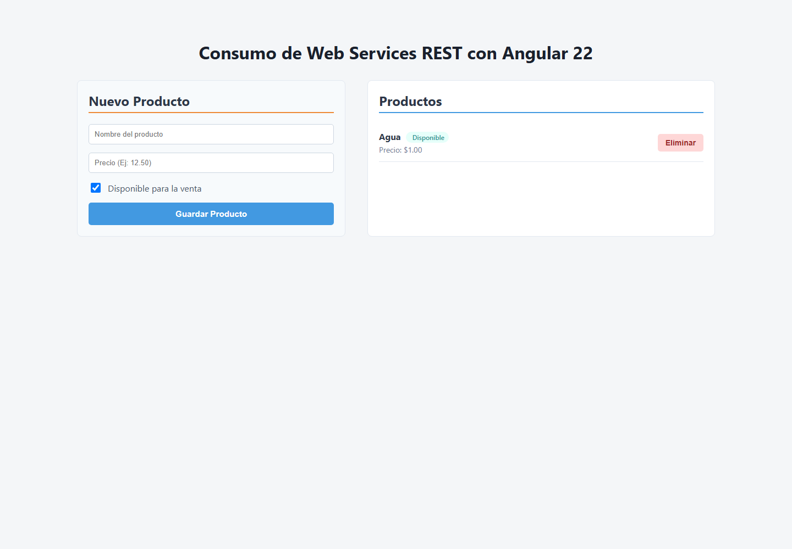

# Catálogo de productos con Angular 22

Aplicación local para practicar consumo de servicios REST con Angular. Lee, crea y elimina productos mediante una API JSON Server; Angular usa un proxy de desarrollo para enviar las peticiones a la API sin configurar CORS en el navegador.



## Funciones

- Muestra productos y sus estados de carga y error mediante `httpResource`.
- Crea productos desde un formulario reactivo con `ngModel` y Signals.
- Elimina productos y vuelve a cargar la lista sin refrescar la página.
- Guarda los datos de prueba en `db.json` mediante JSON Server.
- Centraliza las peticiones HTTP y el manejo de errores en `ProductoService`.

La interfaz actual permite listar, crear y eliminar productos. El servicio también incluye operaciones para consultar y reemplazar un producto por su ID.

## Tecnologías

- Angular 22.2.1 y TypeScript 6
- Angular Signals, `httpResource` y `HttpClient`
- JSON Server 1.0.0-beta.15
- Vitest y jsdom para pruebas unitarias
- Node.js 22 o posterior

## Instalación y ejecución

Instala las dependencias desde la raíz del repositorio:

```bash
npm ci
```

Inicia la API y Angular en dos terminales separadas.

**Terminal 1 — API local:**

```bash
npm run api
```

JSON Server expone los productos en `http://localhost:8080/productos` y persiste los cambios en `db.json`.

**Terminal 2 — aplicación Angular:**

```bash
npm start
```

Abre `http://localhost:4200`. El proxy de `proxy.conf.json` redirige las peticiones de `/api` a la API local.

## Verificación

Ejecuta las pruebas unitarias del servicio HTTP:

```bash
npm test
```

Vitest observa los archivos en modo interactivo; en CI termina al completar la ejecución. Para comprobar el build de producción:

```bash
npm run build
```

## Estructura principal

```text
src/app/producto.model.ts                 Modelo del producto
src/app/producto.service.ts                Operaciones HTTP
src/app/producto.service.spec.ts           Pruebas del servicio
src/app/lista-productos.component.ts       Lista y eliminación
src/app/nuevo-producto.component.ts         Formulario de creación
db.json                                    Datos locales para JSON Server
proxy.conf.json                            Proxy de desarrollo para /api
```

Este proyecto es una práctica local: JSON Server proporciona una API simulada y no incluye autenticación ni un backend de producción.

## Licencia

Este proyecto se distribuye bajo la licencia MIT. Consulta el archivo [LICENSE](LICENSE).
